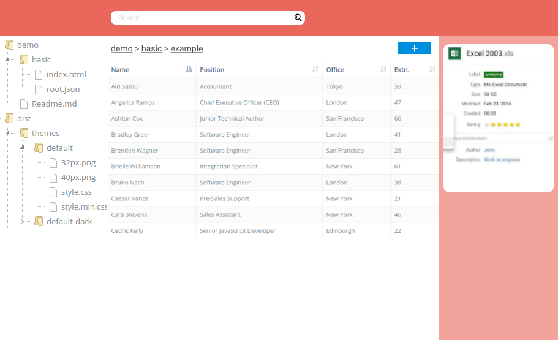
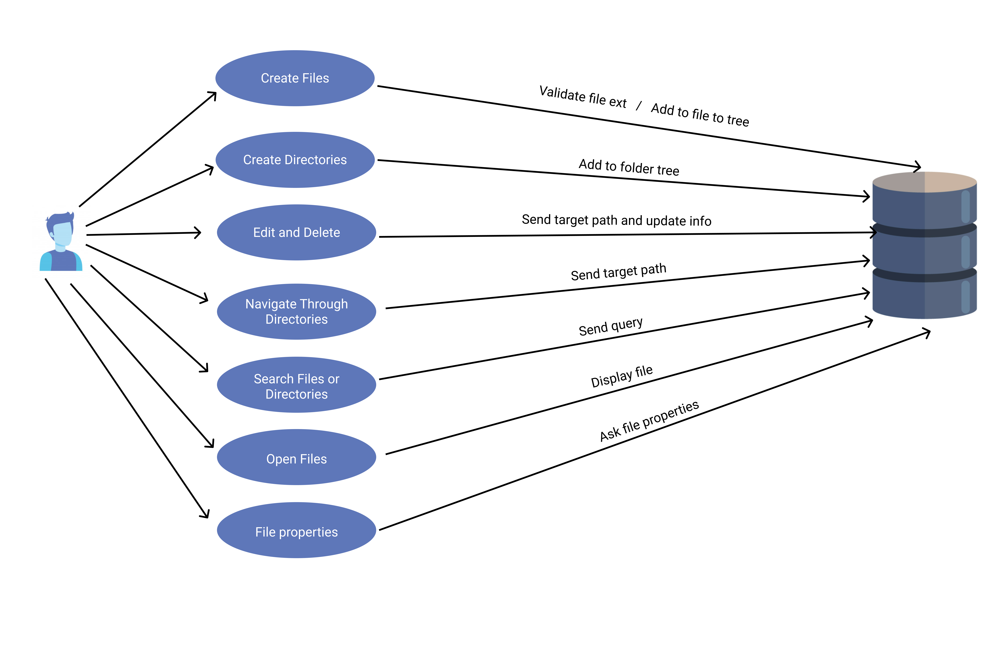
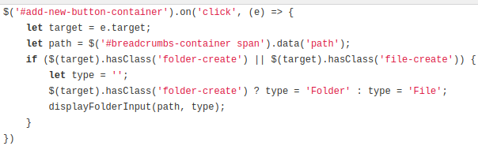
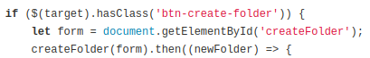
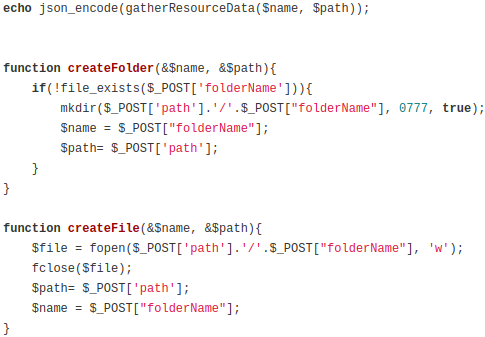
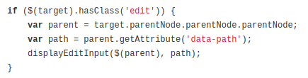
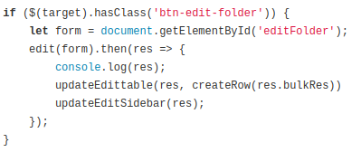
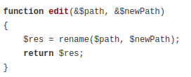
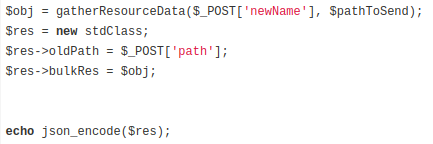

# Coverfy File Manager 

## Project overview
This project consists of a file explorer system that allows the user to navigate through files and folders, create, edit and delete files and folders. There are also other features such as search functionality, display of properties of files and folders, file upload among others.  
  
To organize ourselves, before we started coding we took some steps to make sure the both of us were in the same page and to strategize important aspects of the project such as the git approach and priority hierchy among the features inside the scope of the project.  
  
Here is the wireframe that we created to guide us, the project itself turned out to be a little bit different from this original wireframe, but it is still a relatively accurate representation of the project:  
  

  
With the basic wireframe created we then made a use case diagram to make it more clear all the features that should be included in the project:  
  
  
  

### Git strategy  

The git strategy we used in this project was first creating a master branch and a production branch, then for every feature we created a different branch. Once the feature was working we would merge this branch with the production branch. We kept repeating this process untill the first version of the project was completed, then we made a merge between the production branch and the master branch.  

  

# Code  

## Navigation

## Create files / folders  
  
One of the features of this project is the possibiility to create files and folders. The way we approached this was by displaying a button above the main table with the call to action ***"Add New"*** this button has a dropdown with three options: Upload file, Create Folder and Create File. Each of this options will be trigerred by an event listener on click that will begin the create process. It all happens in the following steps:
  
1) First there is a dynamic input that is displayed.  
2) Then we make a POST request with the information inserted by the user.  
3) PHP will deal with the information, create the flder or file and return with the necessary information in order to allow javascript to create that folder or file's display in the DOM.  
4) Javascript receives the information and display the new file or folder.  

In the ***crud.js*** file you will see the first event listener that will trigger the function ***displayFolderInput(path, type)*** that will display the input so that the user can name the new file or folder.  
  
  

Then another event listener will trigger when the user clicks the button to create file/folder and the information of the name and path for this new file/folder will be sent to PHP via POST request with the function ***createFolder(form)***.  
  
  

PHP will then use the functions ***createFolder(&$name, &$path)*** or ***createFile(&$name, &$path)*** that can be found in ***create.php*** to create the file/folder and will return an object containing all the information regarding this file/fodler with the function ***gatherResourceData($name, $path)*** that can be found in ***utils.php***.  

  

Then javascript will collect this information and dipslay the new file/folder in the DOM.

## Upload files  

## Edit files / folders  
  
Another important feature is the possibility to edit files/folders (in this case is to basically rename them). The user can do it by clicking the edit icon located inside the row of the file/folder he/she wants to edit. This icon will trigger a function that will display an input with the current name of the file/fodler and the user will be able to rename it from this input. Javascript will send the value of the this input to PHP that will take care of renaming the folder/file and return an object with the information of the edited file/folder. Here is the code step by step:  
  
The user will click the icon and then teh function ***displayEditInput($(parent), path)*** will make an input appear to allow the user to rename the file/folder.  
  
  

Then the user will click the button to rename which will trigger the ***edit(form)*** function that will send the new name and path to PHP.  
  
  
  
In ***crud.php*** the function ***edit(&$path, &$newPath)*** will rename the file/fodler. And then an objected will be sent to javascript containing all the information of this renamed file/fodler that will be acquired from the ***gatherResourceData($_POST['newName'], $pathToSend)*** function.  
  
  
  
  

Then with the object sent by PHP javascript will dipslay the renamed file/folder in the DOM. 

## Search

## Preview files

## 

